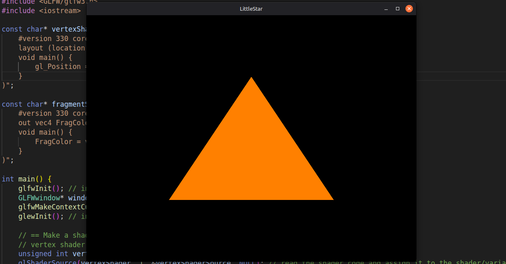

# LittleStar
LittleStar is a [3D][3D_] [C++][C++_] [Game Engine][GameEngine_].
Its not the best [game engine][GameEngine_] yet, but it will improve with every version.

## News -- The First Triangle in V1 !!! --

to go to V1 click [here](V1/)

## Repo Structure 
### Versions
The Project is subdivided in **Versions**. Each Version is like it's own project and has it's **own folder with a readme and [License][LICENSE_]** etc.

## Versions:

⭐ = completely new territory for me

⭐⭐ = I think that makes sense

⭐⭐⭐ = that makes sense

⭐⭐⭐⭐ = I know what I need but what was the code

⭐⭐⭐⭐⭐ = I know the code and logik

The table provides information on how experienced I am at the beginning of the development.
| Version | C++ | GLSL | OpenGL |
|----|------|-------|-------|
|V1|⭐|⭐|⭐|

### **[V1](V1/)**: [Readme](V1/README.md), [License](V1/LICENSE)

[3D_]: https://en.wikipedia.org/wiki/3D
[C++_]: https://en.wikipedia.org/wiki/C%2B%2B
[GameEngine_]: https://en.wikipedia.org/wiki/Game_engine
[LICENSE_]: https://en.wikipedia.org/wiki/License
